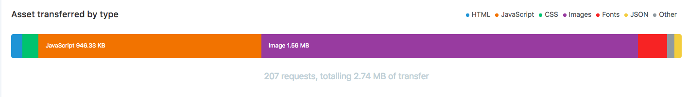

# Performance

Не знаю как всю эту информацию систематизировать.  
И да результаты вариьруются от раза к разу, но я буду ими манипулировать, 
так как разница в плюс минус небольшая (с моего устройства).

**Основные показатели:**  
DOM загрузился за **1.85s**, а вот полностью только за **7.80s**  
Быстренько смотрим Audit  
Первое значимое отображение (First Meaningful Paint) **5.6ms**  
Первая интерактивность (First Interactive) **33.540ms**  
Показатели прямо таки не ахти. 

Выяcняем почему.

**Render Blocking Scripts & Stylesheets** 

В head стрицы просто немеренное количество скриптов и линков.
- Самое простое - перенести все скрипты к закрывающемуся тегу body 
- Нас это не устраивает, ведь мы знаем, что есть async и defer (между прочем, у каких-то скриптов там проставлены эти значения, причем даже примиксованы друг с дургом)  
Я бы выставляла по такому приоритету:  
с async - скрипты от которых ничего не зависит и к закрывающему тегу body их, в head остаются скрипты, только те, 
которые должны быть загружены перед тем как загрузится дом (интересно какие это) и 
с defer, которые должны загрузится первыми и запуститься, как только DOM загрузится. Так мы не будем блокировать рендеринг. 
Но как было сказано на лекции, это надо тестить и проверять как все это дело себя будет вести.
- Современный вариант - Resource Hints. Мы можем использовать preload, Чтобы предварительно загрузить ресурсы. 
При этом мы можем использовать их не только для скриптов. Например, можно использовать их как для стилей, изображений и шрифтов и поодержка уже почти везде (opera mini и IE  - они там всегда).  
Так же можно использовать prefetch для ресурсов с низким приоритетом, которые пригодятся позже и сохранятся в кеше.

Т.е сразу можно сделать preload нужного нам шрифта. И кстати о шрифте,   
link https://fonts.googleapis.com/css?family=Roboto+Condensed:400,700|Roboto:300,300i,400,400i,500,500i,700,900&subset=cyrillic  
Это просто какой-то гиганстский набор для первой загрузки, при этом если заглянуть внутрь, как я понимаю загружаются шрифты не только кирилические, а весь дружный набор
(cyrillic-ext, cyrillic, greek-ext, greek, vietnamese, latin-ext, latin). А для первой отрисовки, да и вообще для всей главной страницы, нужны всего то два начертания: 
Roboto c font-weight: normal и condensed font-weight: bold для заголовков на карточках. Т.е просто сокращаем link наши шрифты rel="preload" as="font" type="crossorigin";
Так можно поступить с логотипом и может заглушкой для неавторизованного пользователя, но не могу сказать насколько это целесообразно. 
Так же что-то можно выставить в загаловках и даже использовать в media выражения, но нам здесь это не поможет. 
Весь критический css тоже ставим под preload с ` as="style" onload="this.rel='stylesheet'`

Ну вообще первыми на страницу подгружаются всякие аналитические скрипты, 
скрипты реклам и для этого нашла такое решиние, асинхронно и не блокирует window onload т.е постройку DOM  
`<link rel="preload" as="script" href="async_script.js" onload="var script = document.createElement('script'); script.src = this.href; document.body.appendChild(script);">`

Где можно использовать технику прогрессивного css (вставляя link перед каждым блоком), я не вижу, на главной странице, все очень похоже.

Если посмотреть во вкладку Network  

Видим что  ресурсы встали в очередь одновременно с одинаковым приоритетом, а загружаются в разное время.

Я бы сказала, что это ограничение по протоколу HTTP на количество паралельных запросов, 
но вроде все эти ресурсы идут по протоколу HTTP 2 (где количество паралельных запросов больше) и используют cdn сети, но что-то пошло не так.

**Optimize (Minify) resources** 

Банально, но многие скрипты и css файлы не минифицированы, так же дело обстоит и с изображениями, а их количество доминирует

**Save images in next-gen formats** 

Использовать прогрессивный JPEG, WepP, Lossy GIF, SVGOMG

Плюс сюда можно добавить, что как раз таки изображения грузятся по HTTP 1

**Unused CSS rules & JS** 

Грузитсся очень достаточно большое количество скриптов и css файлов, которые не используются в документе. 
Например, fontawesome, outer.css, outer.js, main.css, main.min.css, all.min.css?ver=1.0.0, style.css?ver=14, nivo-lightbox-overlay min.css, deafult.css,
common.js, viewed.js, all.min.js?ver=1.0.0, nivo-light.js, 
front.js (тоже не нужен на этой странице и судя по содержанию этого скрипта, я бы им посоветовала все таки определиться с одним слайдером, максиму двумя, а то там case на все случаи жизни)

Думаю под этот пункт так же можно записать, что существуют такие файлы как homepage.css?ver=7, в которых всего 3 строчки, почему, зачем, за что?
 Их либо размещать инлайн, либо добавить уже в какой нибудт common.css
 
 
**Layout**

Макет сверстан на float, вроде бы как flex быстрее будет

Происходит перерисовка макета - плашка - клуб лайфхакеров - заменить top на transform  и сделать will-change: transform (для старичков transform: translateZ(0))
Для самих изображений скорее не надо выделять, так как будет выделять память и утекать.

И вот мы дошли до этих изображений, которые якобы загружаются c lazyloading  и должны вообще опитимизировать загрузку страницы, но как раз таки эти скрипты попадают
под профилирование как LONG TASK (остальное почти все это аналитеские скрипты).

Получается, что функция `lazyLoadThumbnails` расчитывается почти всегда по скролу, почему? потому что вот, что проверяется `if ($self.css('opacity') == 1) return;`,
и если наша мышь находится на картинках и мы проискроливаем, мы снова выполняем скрип и перасчитываем, потому что при скроле opacity меняется на 0.8 
(т.е либо > 0, !==0, либо навешивать класс, потому что при ховере стоит !important это уж совсем некрасиво)
а isElementInViewport выполняется всегда при скрорле, а там `(rect.top - 300) <= (window.innerHeight || document.documentElement.clientHeight)` 
Вообще все эти height можно сохранить куда-то выше и только перарасчитывать при рейсайзе, а при показе всех изображений отвязывать событие scroll вообще.
Долгое сохранение в объект $self.

Как я поняла, сейчас уже можно использовать для такого IntersectionObserver API чтобы следить попал ли элемент в область видимости

Вообще тема написания js здесь довольно таки больная, есть что поравить 

[Напишу позже.....]

**Small things**

Все ссылочки с `http://` заменить на просто `//` - мелочи, а приятно

Как я поняла к некоторым ресурсам лучше было не примянть было gzip (Обращаеем внимание на размер файлов)
вверху должен быть ужатый размер - Transferred size  
внизу - Actual size  
Можно указать минимальный размер  файла, потому что файлы весят мало и скорре всего на поддержку словаря GZIP уходит больше затрат, 
чем на его сжатие.

 
 
